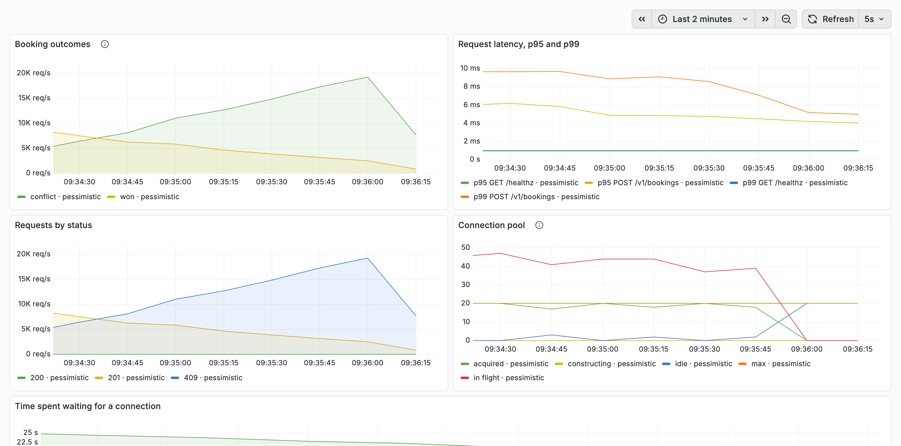

# Highload Ticket Booking

A seat booking service that never sells the same seat twice, however many
people ask for it at the same moment — and that can prove it, in tests and
under load.

```bash
docker compose up --build -d
curl -X POST localhost:8080/v1/bookings -H 'X-User-Id: 1' -d '{"event_id":1,"seat_id":1}'
```

## The problem

A thousand people want the same seat. Exactly one of them should get it, the
rest should be told plainly that it is gone, and nobody should be told it is
theirs when it is not. Everything below exists to make that true, and to say
what it costs.

## Where the guarantee lives

In the schema, not in the application:

```sql
CREATE UNIQUE INDEX bookings_one_live_per_seat
    ON bookings (seat_id)
    WHERE status IN ('held', 'confirmed');
```

A seat carries at most one booking that is still alive. Application code can
be wrong, deployed twice, or racing itself; this index cannot be talked out of
it. The repository maps its unique violation back to the same "seat is taken"
that a lost race produces, so callers cannot tell which check caught them.

Two more rules are enforced the same way:

- `bookings (seat_id, event_id)` references `seats (id, event_id)`, so a
  booking cannot name an event its seat does not belong to.
- `bookings (seat_id, event_id)` is also indexed, because Postgres does not
  index the referencing side of a foreign key by itself. Without it, touching
  a seat row scans every booking ever made — this was found the slow way, with
  a load-test reset that took minutes.

`seats.status` is a denormalised copy of that truth, updated in the same
transaction. It exists so that drawing a seating plan is one indexed read
rather than a join against every live booking.

## Three ways to resolve the race

The invariant holds regardless; the strategies differ in how contention is
resolved and what it costs. `BOOKING_STRATEGY` picks one at startup, and all
three run the same integration suite, because they are three implementations
of one contract.

| Strategy | How it takes the seat | What a loser does |
|---|---|---|
| `pessimistic` | `SELECT … FOR UPDATE` on the seat row | waits for the winner to commit, then reads the new status |
| `optimistic` | reads status and `version`, then `UPDATE … WHERE version = $1` | sees zero rows changed and re-reads, up to three times |
| `atomic` | one `UPDATE … WHERE status = 'available'` | pays for a second query only to tell "gone" from "never existed" |

### Measured

50 virtual users, 30 seconds per run, one Postgres 17 container and one API
container on a laptop, pool capped at 20 connections. `hot_seat` points every
user at the same seat, which rotates once a second, so each second is a fresh
race among fifty. `spread` picks seats at random out of a million to measure
the same path with nothing contended.

**hot_seat** — everyone after the same seat:

| Strategy | req/s | p95 | Seats won | Conflicts | Failures |
|---|---:|---:|---:|---:|---:|
| pessimistic | 7 594 | 9.5 ms | 31 | 227 821 | 0 |
| optimistic | 7 382 | 10.2 ms | 31 | 221 500 | 0 |
| atomic | 7 336 | 10.1 ms | 31 | 220 083 | 0 |

Thirty-one winners in thirty-one seconds, in all three: one seat, one buyer,
every second, with a quarter of a million requests arguing about it.

**spread** — a million seats, chosen at random:

| Strategy | req/s | p95 | Bookings | Conflicts | Failures |
|---|---:|---:|---:|---:|---:|
| pessimistic | 11 844 | 6.9 ms | 299 139 | 56 231 | 0 |
| optimistic | 10 322 | 8.5 ms | 266 772 | 42 918 | 0 |
| atomic | 11 467 | 7.4 ms | 291 142 | 52 909 | 0 |

Conflicts appear here too, and they should: by the end of a run a third of the
pool is sold, so a random pick lands on a taken seat often enough to matter.

Pessimistic and atomic are within a few percent of each other — one laptop,
one run each, so that gap is not a result. Optimistic is reliably behind, and
that one is real: it reads the row before it writes it, and pays for the extra
round trip on every single attempt.

Read it as *these three are close*, not as a league table: the seat row is a
single row either way, and at this scale the cost is dominated by the round
trip and the commit, not by the locking. What differs is where the waiting
happens — and under `hot_seat` every strategy still ends each second with
exactly one winner.

## A booking is a hold

Taking a seat does not sell it. It creates a hold with an expiry, and one of
three things happens next:

- **confirmed** — `POST /v1/bookings/{id}/confirm`, and the seat is sold.
- **cancelled** — `DELETE /v1/bookings/{id}`, and the seat goes back.
- **expired** — nobody did anything in time, and a background sweep takes it
  back:

```sql
SELECT id, seat_id FROM bookings
 WHERE status = 'held' AND expires_at <= now()
 ORDER BY expires_at LIMIT $1
   FOR UPDATE SKIP LOCKED
```

`SKIP LOCKED` is what lets more than one instance run the sweep: each worker
picks up rows nobody else is holding instead of queueing behind them. Whether
a hold has run out is decided by the database clock, never by the application's
— two clocks would eventually disagree about the same booking.

## Retries do not double-book

A client that times out and retries is not asking for a second seat. Send
`Idempotency-Key` and the answer is the original booking with `200` instead of
`201`:

```bash
curl -X POST localhost:8080/v1/bookings \
     -H 'X-User-Id: 1' -H 'Idempotency-Key: checkout-42' \
     -d '{"event_id":1,"seat_id":7}'
```

The interesting case is not the retry that arrives late — it is the copy that
arrives *while the first one is still running*. It loses either the seat or the
unique index on the key, and both mean the same request already won, so it
replays the winner's booking rather than reporting a conflict. The test fires
twenty copies at once and expects one booking and nineteen replays.

## Authentication

Out of scope, deliberately. The caller states who they are in `X-User-Id`,
exactly where a token subject would go. Ownership is still enforced in SQL:
confirm and cancel match on `user_id`, so one user cannot touch another's
booking, and an attempt reads as `404` rather than `403` so the API does not
confirm that the booking exists.

## API

| Method | Path | |
|---|---|---|
| POST | `/v1/bookings` | hold a seat; `201`, or `200` when replaying an `Idempotency-Key` |
| POST | `/v1/bookings/{id}/confirm` | turn a hold into a sale |
| DELETE | `/v1/bookings/{id}` | give the seat back |
| GET | `/v1/events/{id}/seats` | the seating plan with current statuses |
| GET | `/healthz` · `/readyz` | liveness · readiness, which pings the pool |
| GET | `/metrics` | Prometheus |

Every request carries `X-User-Id`. Errors are JSON with a machine-readable
code:

```json
{ "error": "seat_taken", "message": "seat is already taken" }
```

`invalid_request` → 400, `*_not_found` → 404, `seat_taken` and
`booking_not_held` → 409. Anything unmapped is logged in full and answered
with a bare `internal error`: the database never speaks to the client.

## Observability

```bash
docker compose --profile obs up -d      # Prometheus on :9090, Grafana on :3000
```



Every metric carries the strategy as a label, so two runs sit on one dashboard
without renaming anything. Latency is labelled by route pattern rather than by
URL, which keeps the label set bounded no matter what people request.

The panel worth watching is the connection pool: when acquired connections sit
at the maximum while requests in flight climb past it, the pool *is* the queue,
and the latency you are looking at is mostly waiting for a connection rather
than waiting for Postgres.

Successful requests log at debug level. At these rates the access log is the
first thing to become a bottleneck, and the interesting lines are the ones that
failed anyway.

## Running it

Requires Docker. `docker compose up --build` brings up Postgres, applies the
migrations from inside the binary, and seeds one event with a hundred seats and
five hundred users, so the API is bookable immediately.

```bash
make up          # build and start, wait for healthy
make logs
make down        # and drop the volume
make test        # go test ./... -race, testcontainers included
make lint        # gofmt -l, go vet
```

`API_PORT` and `POSTGRES_PORT` move the published ports when something else
already owns them.

### Reproducing the benchmarks

```bash
make load           # every strategy, both scenarios, summaries under loadtest/results
make load-hot       # one scenario against whatever is running
make load-spread
```

`make load` restarts the API once per strategy, rebuilds the seat pool between
runs, and keeps each k6 summary. k6 runs in a compose profile, so nothing is
installed locally.

## Configuration

| Variable | Default | |
|---|---|---|
| `DATABASE_URL` | — | required; the service refuses to start without it |
| `BOOKING_STRATEGY` | `pessimistic` | `pessimistic`, `optimistic`, `atomic` |
| `HOLD_TTL` | `10m` | how long a hold survives unconfirmed |
| `EXPIRE_EVERY` · `EXPIRE_BATCH` | `10s` · `100` | sweep interval and batch size |
| `DB_MAX_CONNS` | `20` | pool size |
| `API_ADDR` · `LOG_LEVEL` · `SHUTDOWN_TIMEOUT` | `:8080` · `info` · `10s` | |

A malformed value fails at startup with the name of the variable rather than
being silently ignored.

## Layout

```
cmd/api              entry point: config, wiring, signals
internal/booking     domain types, use cases, the expiry worker
internal/postgres    repository, the three strategies, migrations
internal/httpapi     routes, JSON errors, logging and metrics middleware
internal/metrics     Prometheus registry and the pool collector
internal/config      environment
loadtest/            k6 scenarios and the benchmark script
deploy/              Prometheus config, provisioned Grafana dashboard
```

The transaction lives in the repository rather than in the service: what it
protects is a database invariant, and the strategies that resolve contention
are pure SQL. The domain does not know that `FOR UPDATE` exists.

## Tests

```bash
make test           # everything
go test ./... -short  # skips anything that needs Docker
```

The integration tests run against a real Postgres in testcontainers, and every
one of them runs three times, once per strategy. The load-bearing one fires a
hundred concurrent bookings at a single seat and asserts that exactly one
succeeds, ninety-nine are told the seat is taken, and the table holds one live
booking — not just that the counts look right, but that the database agrees.
